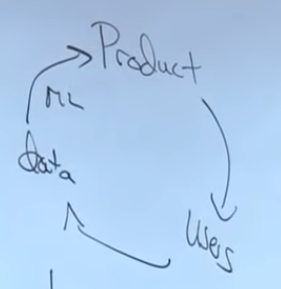
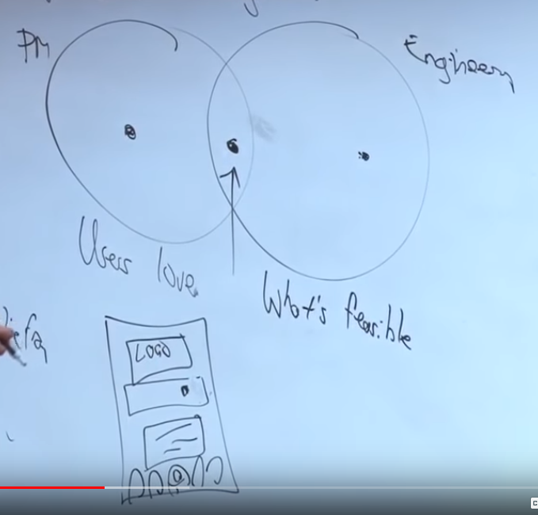
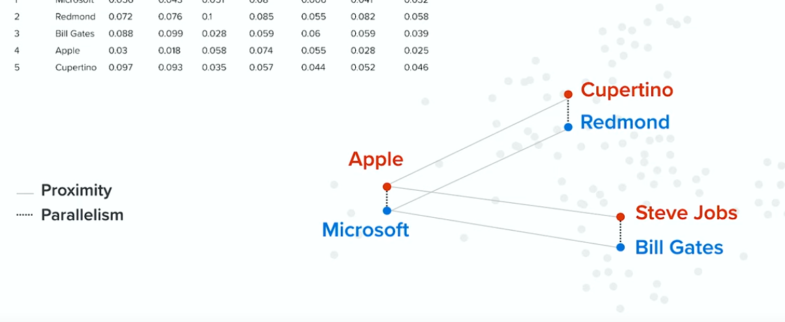
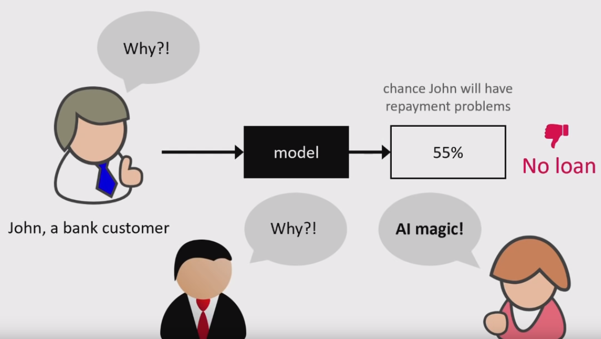
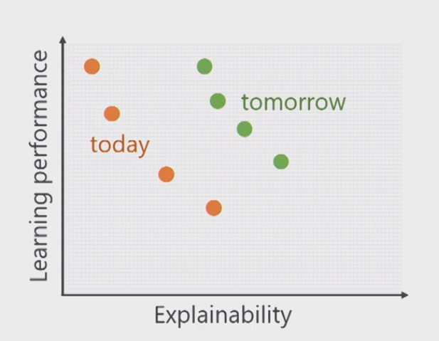

% Explainable AI
% Miguel Sánchez de León Peque
% 2020

# Presentation

## Hi! :wave:

- [Miguel Sánchez de León Peque](https://www.linkedin.com/in/peque)
- [OpenSistemas](http://www.opensistemas.com)
- Data scientist
- Programming, data, machine learning
- Python :heart:

## Abstract

- TODO

# Introduction

## AI is the new electricity

- IT, healthcare, transportation... heirdressing?
- Mostly supervised (based on economic value)

## Can AI do it?

- No universal rule
- Can a human do it?
  - Feasible
  - Data
  - Insights
- Takes a human less than 1 second of thought?

## Why now?

## Resources

- :white_check_mark: Algorithms
- :white_check_mark: Computing power
- :x: Data
- :x: Talent

## Data scarcity?

## AI Product management

## Communicate through data

Come up with a good dataset:

- 10 years of audio recordings
- Accents (Spanish, Mexican...)
- Noise (cafe, car...)
- Bandwidth

## Impact on business

# Supervised learning

## Mapping

- Spam detection
- Image classification
- Speech recognition
- Language translation
- Add clicking

## Expectations

## Reality

- Facebook? (black monkeys)
- Tesla (rain inside tunnels)
- Trains (detecting train lanes)
- Tanks (all enemies at night)
- Sex bias
- Racial bias

## Word embedding

## Gender analogies

> - she
>   - he
> - sister
>   - brother
> - nurse
>   - doctor
> - OMG
>   - WTF
> - feminist
>   - realist
> - pregnancy
>   - kidney stone

## Demo

# XAI

## Problem

## Goal

# That's all! :tada: :beers: :smile:

## Resources

- https://www.youtube.com/watch?v=21EiKfQYZXc
- https://www.youtube.com/watch?v=rI_L95qnVkM
- https://www.youtube.com/watch?v=CY3t11vuuOM
- https://www.youtube.com/watch?v=B-c8tIgchu0
- https://github.com/slundberg/shap
- https://github.com/ibm/aix360
- https://cloud.google.com/explainable-ai/

## Thanks! :heart:
