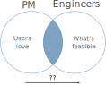
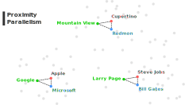
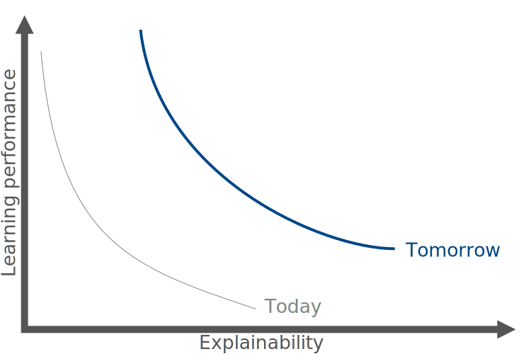
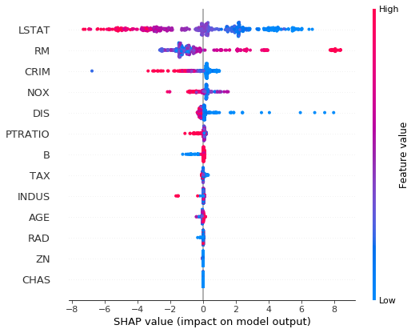

% Explainable AI
% Miguel Sánchez de León Peque
% 2020

# Presentation

## Hi! :wave:

- [Miguel Sánchez de León Peque](https://www.linkedin.com/in/peque)
- [OpenSistemas](http://www.opensistemas.com)
- Data scientist
- Programming, data, machine learning
- Python :heart:

## Abstract

- AI
- Supervised learning
- XAI
- Feature attributions, WIT, Google...

# Introduction

## AI is the new electricity

- IT, healthcare, transportation... heirdressing?
- Mostly supervised (based on economic value)

## Can AI do it?

- No universal rule
- Can a human do it?
  - Feasible
  - Data
  - Insights
- Takes a human less than 1 second of thought?

## Why now?

## Resources

- :white_check_mark: Algorithms
- :white_check_mark: Computing power
- :x: Data
- :x: Talent

## Data scarcity?

{width=50%}

## AI Product management

## Communicate through data

Come up with a good dataset:

- 10 years of audio recordings
- Accents (Spanish, Mexican...)
- Noise (cafe, car...)
- Bandwidth
- Skew (training/testing draw in an IDD* manner)

> * Independently and identically distributed

## Impact on business

# Supervised learning

## Mapping

- Spam detection
- Image classification
- Speech recognition
- Language translation
- Add clicking

## Expectations

## Reality

- Trains (detecting train lanes) and wolves (detecting snow)
- Facebook? (black monkeys)
- Tesla (rain inside tunnels)
- Tanks (all enemies at night)
- Sex bias
- Racial bias

## Word embedding

## Gender analogies

> - she
>   - he
> - sister
>   - brother
> - nurse
>   - doctor
> - OMG
>   - WTF
> - feminist
>   - realist

## And more...

- computer programmer --> homemaker?
- mexicans --> hipanics, latinos, illegals...?

## Demo

# XAI

## Definition

> XAI is the ability to explain or to present in understandable terms to a human

---

## Problem: why?

## Goal

---

- Inform and support human decision
- Trust in model predictions
- Transparency of the methodology
- Scope of the model
- Enable debugging
- Enable auditing
- Verify generalization ability

## Research

- Input attribution: LIME, LOCO, SHAP, DeepLift, XRAI...
- Concept testing/extraction: TCAV, DeepR...
- Example influence/matching: MMD Critic, Influence Functions, Attention-Based Prototypical Learning
- Distillation: distilling a neural network into soft decision tree

# Feature attributions

## Features

- Not independent!
- Attribution? :thinking:
- Game theory: Shapley* values

> *not the one in "A Beautiful mind", that was Nash

## Shapley values

$N$ employees and $v(N)$ profit to distribute

{width=60%}

$$
A_{avg} = 30, B_{avg} = 25, C_{avg} = 45
$$

## It is a complex problem

- Baselines: $\{B, C\} \rightarrow [\beta_1, x_2, x_3]$
- Complexity: $\mathcal{O}(n!)$
- Solutions: [SHAP](https://arxiv.org/abs/1705.07874)

> SHAP integrates and improve other previous methods such as LIME

## Features force

## Features summary

{width=60%}

## Deep learning example

## Advantages

- Debugging models (i.e.: detecting radiologist's pen marks)
- Optimizing models (i.e.: remove less important features)

## Limitations

- Attributions are specific to individual predictions (but you can aggregate)
- Does the issue come from the model or the data?
- Adversarial attacks

## Other examples

TreeExplainer: Tree SHAP, a fast and exact algorithm for ensembles of trees:

- [NHANES](https://slundberg.github.io/shap/notebooks/NHANES%20I%20Survival%20Model.html)

DeepExplainer: Deep SHAP, a faster but approximate algorithm for DL models:

- [MNIST digit classification](https://slundberg.github.io/shap/notebooks/deep_explainer/Front%20Page%20DeepExplainer%20MNIST%20Example.html)

KernelExplainer: Kernel SHAP, a model-agnostic method to estimate SHAP values:

- [ImageNet VGG16](https://slundberg.github.io/shap/notebooks/ImageNet%20VGG16%20Model%20with%20Keras.html)

## Google

- [AI Explanations with AI Platform Prediction](https://cloud.google.com/ai-platform/prediction/docs/ai-explanations/using-feature-attributions)

Examples:

- [Predict the duration of a bike trip](https://colab.research.google.com/github/GoogleCloudPlatform/ml-on-gcp/blob/master/tutorials/explanations/ai-explanations-tabular.ipynb)
- [AI Explanations: Explaining an image data model](https://colab.research.google.com/github/GoogleCloudPlatform/ml-on-gcp/blob/master/tutorials/explanations/ai-explanations-image.ipynb)

# What-If-Tool

# That's all! :tada: :beers: :smile:

## Thanks! :heart:
